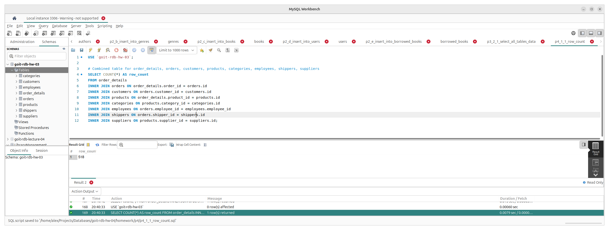
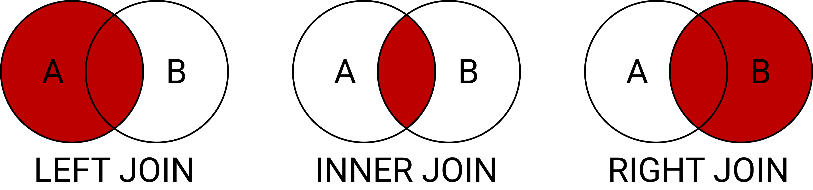
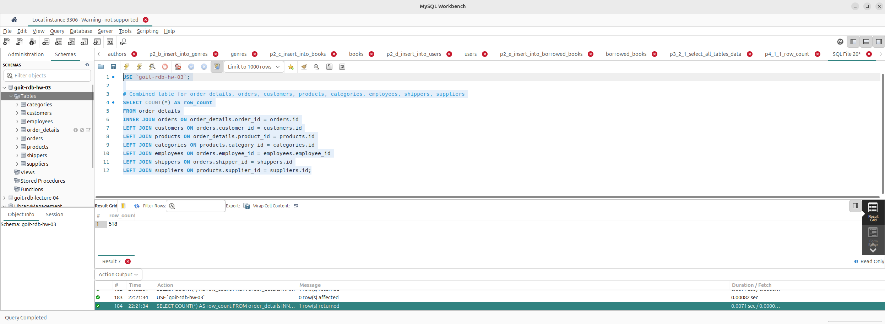

## Input data

Маємо такий SQL запит для об'єднання всіх таблиці у одну:

```sql
USE `goit-rdb-hw-03`;

-- Combined table for order_details, orders, customers, products, categories, employees, shippers, suppliers
SELECT COUNT(*) AS row_count
FROM order_details
INNER JOIN orders ON order_details.order_id = orders.id
INNER JOIN customers ON orders.customer_id = customers.id
INNER JOIN products ON order_details.product_id = products.id
INNER JOIN categories ON products.category_id = categories.id
INNER JOIN employees ON orders.employee_id = employees.employee_id
INNER JOIN shippers ON orders.shipper_id = shippers.id
INNER JOIN suppliers ON products.supplier_id = suppliers.id;
```

<p align="center">
  
</p>

## Task

* Змініть декілька операторів INNER на LEFT чи RIGHT. 
* Визначте, що відбувається з кількістю рядків. Чому? 
* Напишіть відповідь у текстовому файлі.

## Analysis and Explanation

Вимога до нормалізації даних у базі даних (зокрема 2 нормальна форма) вимагає розбиття та розміщення залежних від основного ключа даних до різних таблиць. При роботі з даними нам потрібно об'єднувати такі таблиці за допомогою оператору `JOIN`. Характер такого об'єдняння залежить від обраного типу об'єднання, напр. `INNER JOIN`, `LEFT JOIN`, `RIGHT JOIN` та інші.

При об'єднанні двох таблиць кожна з них може сприйматись умовно як "ліва" (A) або "права" (B), що гарно показано на прикладі типів об'єднань на діаграмі Венна:

<p align="center">
  
</p>

Різниця у різних типів об'єднань полягає у тому, які дані та на базі якої з таблиць будуть на виході. Так напр. `INNER JOIN` побудує таблицю з даних, які присутні у обох таблицях (можна сказати "на їх перетині"), інші дані будуть проігноровані.
`LEFT JOIN`, в свлю чергу, візьме дані з "лівої" таблиці (як базу) та лише ті дані з "правої" на які є посилання в лівій, іншим даним буде присвоєно null. `RIGHT JOIN` працює як і `LEFT JOIN`, але навпаки, коли побудова таблиці виконується відносно "правої" таблиці.

Тепер спробуємо змінити `INNER JOIN` на `LEFT JOIN` і подивимось на результат.

```sql
USE `goit-rdb-hw-03`;

-- Combined table for order_details, orders, customers, products, categories, employees, shippers, suppliers
SELECT COUNT(*) AS row_count
FROM order_details
INNER JOIN orders ON order_details.order_id = orders.id
LEFT JOIN customers ON orders.customer_id = customers.id
LEFT JOIN products ON order_details.product_id = products.id
LEFT JOIN categories ON products.category_id = categories.id
LEFT JOIN employees ON orders.employee_id = employees.employee_id
LEFT JOIN shippers ON orders.shipper_id = shippers.id
LEFT JOIN suppliers ON products.supplier_id = suppliers.id;
```

<p align="center">
  
</p>

Як видно зі скріншоту више, кількість отриманних рядків при заміні операторів `INNER JOIN` на `LEFT JOIN` не змінилась і так само є 518. Так як ми будуємо наше об'єднянн віносно ("лівої") таблиці `order_details`, можна зробити висновок, що всі дані у "правих" таблицях відповідають даним у "лівій".

Тепер спробуємо змінити `INNER JOIN` на `RIGHT JOIN` і подивимось на результат.

```sql
USE `goit-rdb-hw-03`;

-- Combined table for order_details, orders, customers, products, categories, employees, shippers, suppliers
SELECT COUNT(*) AS row_count
FROM order_details
RIGHT JOIN orders ON order_details.order_id = orders.id
RIGHT JOIN customers ON orders.customer_id = customers.id
RIGHT JOIN products ON order_details.product_id = products.id
RIGHT JOIN categories ON products.category_id = categories.id
RIGHT JOIN employees ON orders.employee_id = employees.employee_id
RIGHT JOIN shippers ON orders.shipper_id = shippers.id
RIGHT JOIN suppliers ON products.supplier_id = suppliers.id;
```

<p align="center">
  
</p>

Як видно зі скріншоту више, кількість отриманних рядків при заміні операторів `INNER JOIN` на `RIGHT JOIN` також не змінилась і зберігається у кількості 518. Так як ми будуємо наше об'єднянн віносно ("правих") таблиць, можна знову ж таки зробити висновок, про відповідність даних як у "лівій", так і у "правій" таблицях.

## Conclusion

Можна констатувати ПОВНУ відповідність даних у "лівій/их" та "правій/их" таблицях між собою і цілісність даних, правильне налаштування foreign keys для таблиць та що в даному випадку і при наявних даних `INNER JOIN`, `LEFT JOIN` та `RIGHT JOIN` еквівалентні, з точки зору отриманого результату. 
Якщо б була яка-небудь невідповідність даних у таблицях, то значення кількості рядків би  відрізнялось.